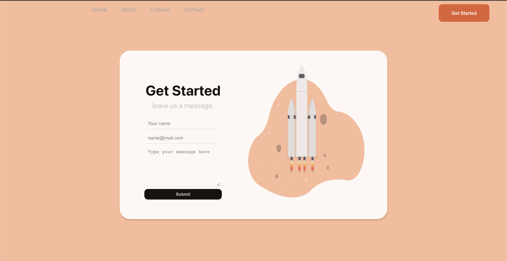

# LearnApp

Web App ainda em desenvolvimento utilizando ReactJS

# O que e?
Aplicativo Web que simula um site de aprendizado :books:

##:iphone: Tecnologias

<table>
<thead>
<th>React JS </th>
</thead>
<tr>
<td>CSS3</td>
</tr>
<tr>
<td>react-anchor-link</td>
</tr>
</table>

#Desenvolvido por github.com/souzatotolo
